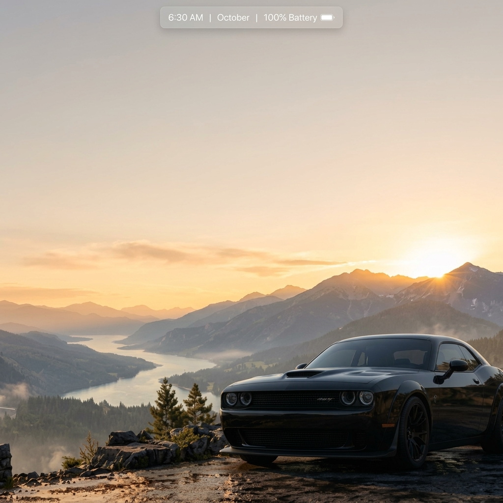
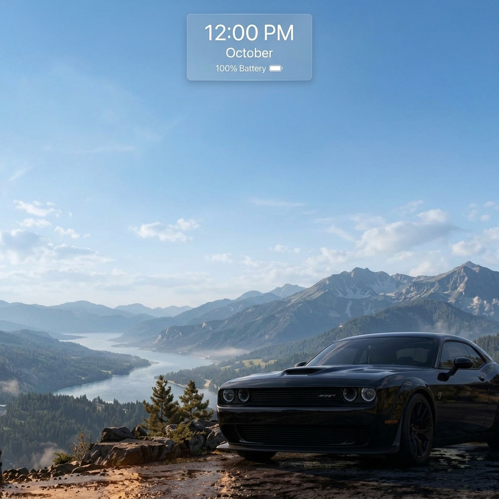
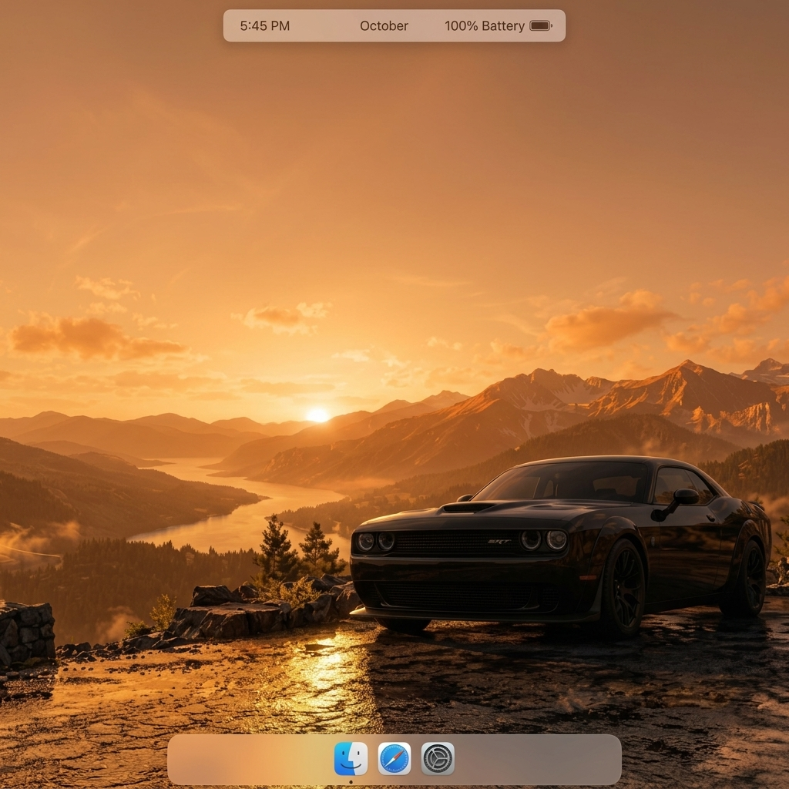
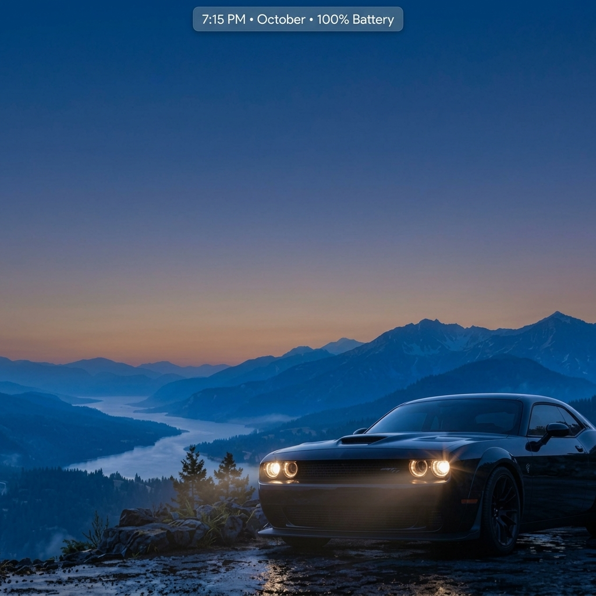
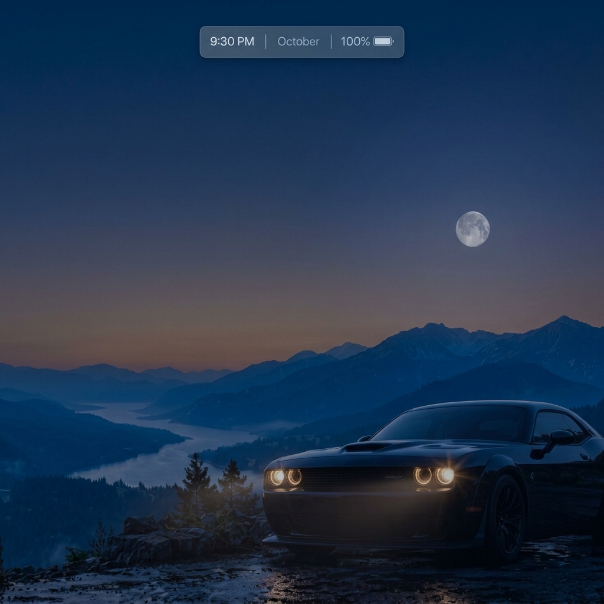
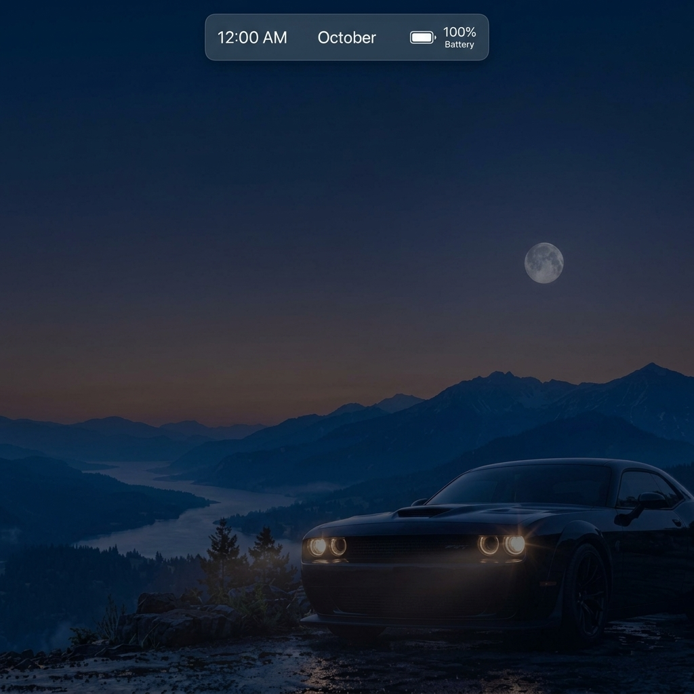

# NIGHTDRIVE

A cinematic, time-aware desktop wallpaper. A black muscle car on a winding mountain road
smoothly transforms through **sunrise → day → golden hour → dusk → night → midnight**
following your real local time, with a live HUD (clock, date, weather, battery) and quick
system controls.


| Sunrise | Day | Golden Hour |
|---|---|---|
|  |  |  |
| **Dusk** | **Night** | **Midnight** |
|  |  |  |

## Features

- **Real-time scene blending**: 20-minute crossfades between six periods, with headlights fading in at dusk.
- **HUD**: clock, date, live weather (Open-Meteo), battery level and charging state.
- **Quick controls**: Wi-Fi, Bluetooth, Volume, Focus. These open the matching OS settings page on Windows and macOS.
- **Desktop atmospheres**: Windows, macOS and Linux styling. The default follows your OS and your choice is remembered.
- **Works on all screen sizes**: desktop, laptop, 4K, tablet and phone (portrait and landscape). Handles notches and safe areas.
- **Accessible**: keyboard navigable, visible focus, labelled controls, Esc closes dialogs. Respects *Reduce Motion* and Windows High Contrast.
- **No build step**: plain HTML/CSS/JS in [`engine/`](engine/).

## Quick start (any device, in a browser)

```bash
git clone https://github.com/nitinsingla256-collab/NIGHTDRIVE.git
cd NIGHTDRIVE
npm start            # serves engine/ at http://localhost:8080
```

No Node? Any static server works, e.g. `python3 -m http.server 8080 -d engine`.
Open it fullscreen (F11) for the full wallpaper experience.

## Run as a desktop wallpaper

| Platform | Host | How |
|---|---|---|
| **Windows 10/11** | Native WebView2 host ([`hosts/windows/`](hosts/windows/)) | Download `NIGHTDRIVE-Windows-Host.zip` from [Releases](../../releases), or build it with `dotnet publish hosts/windows/NightdriveHost/NightdriveHost.csproj -c Release -r win-x64` (needs the [.NET 8 SDK](https://dotnet.microsoft.com/download/dotnet/8.0)) |
| **Windows 10/11** | [Lively Wallpaper](https://www.rocksdanister.com/lively/) | *Add Wallpaper* → choose `engine/index.html` |
| **Windows / macOS / Linux** | Tauri app ([`src-tauri/`](src-tauri/)) | `npm install && npm run tauri:build` (needs [Rust + Tauri prerequisites](https://tauri.app/v1/guides/getting-started/prerequisites)) |
| **macOS** | Native Swift host ([`hosts/macos/`](hosts/macos/)) | `python3 hosts/macos/build_macos.py` → `open hosts/macos/NIGHTDRIVE.app` (renders behind desktop icons on all monitors) |
| **Linux (X11)** | PyQt host ([`hosts/linux/`](hosts/linux/)) | `bash hosts/linux/install-linux.sh` (installs deps, menu entry and autostart) |

### What each feature needs

| Feature | Browser / Lively | Windows host | macOS host | Linux host |
|---|---|---|---|---|
| Scenes, clock | ✅ | ✅ | ✅ | ✅ |
| Weather | ✅ (location permission or IP fallback) | ✅ | ✅ | ✅ |
| Battery | Chromium browsers only | ✅ | Chromium-only API* | ✅ (psutil) |
| Settings buttons | Windows only | ✅ | ✅ | indicator only |

\* Safari/WebKit doesn't expose battery info, so the widget shows *N/A*.

## Project structure

```
NIGHTDRIVE/
├── engine/                 # The wallpaper itself (shared by every host)
│   ├── index.html
│   ├── script.js           # time engine, HUD, weather, battery, controls
│   ├── styles.css          # layout, responsive & accessibility rules
│   ├── engine-start.wav    # ignition sound played with the startup sequence
│   └── assets/             # per-period scenes + headlight overlays (see assets/README.md)
├── hosts/
│   ├── windows/            # .NET 8 WPF + WebView2 host (desktop layer, tray, battery, Wi-Fi/BT)
│   ├── linux/              # PyQt5 X11 desktop host + installer
│   └── macos/              # Swift/WKWebView desktop-level host + build script
├── src-tauri/              # Cross-platform Tauri v1 host
├── scripts/                # serve.mjs (dev server), validate.mjs (tests)
├── docs/screenshots/
└── .github/workflows/ci.yml
```

## Customising

- **Times and transitions**: edit `PERIODS` at the top of [`engine/script.js`](engine/script.js).
- **Images**: replace files in `engine/assets/<period>/`. See [`engine/assets/README.md`](engine/assets/README.md).
- **Startup sound**: drop an audio file into `engine/` and set `src` on the `<audio id="engine-audio">` tag.

## Development

```bash
npm test     # validates engine files, asset paths and host configs (also runs in CI)
npm start    # local preview
```

See [CHANGELOG.md](CHANGELOG.md) for release notes.
